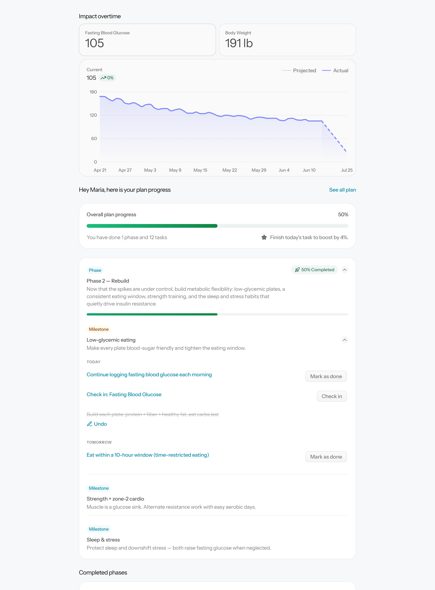

# 90-Day Blood Sugar Reset — Example Plan

An example Kodara **client plan** for a metabolic-health doctor (Dr. Reyes) who helps
clients reverse type 2 diabetes through lifestyle change, plus 90 days of realistic
metric check-in data showing the progression — rendered in the actual white-label
client **Plans** view.

> Sample/illustrative data only — not medical advice.

## What's here

| File | What it is |
|------|------------|
| `wl-plans-view/` | **The showcase** — the built white-label client **Plans** view. This is a real Vite build that renders the **actual** kodara WL components, not a copy. Open `index.html` (or the live link). |
| `wl-harness/` | The Vite harness that produces `wl-plans-view/`. It imports the real components straight from a kodara checkout (`WLPlanMetricsPanel`, `WLOverallPlanProgressCard`, `WLPhaseCard`, `WLTaskRow`, …), uses the real Tailwind v4 + recharts + `lib/plans` progress math, and mocks only the data layer. See `wl-harness/README.md`. |
| `plan-template.json` | The coach's plan template. Drop-in valid against Kodara's `PlanTemplate` schema (`planTemplateSchema`) — 13 weeks, 3 phases, 23 tasks, 2 metrics. |
| `data/check-ins.json` | 103 metric check-ins in the `client_plan_metric_check_ins` row shape (90 daily glucose + 13 weekly weight). |
| `data/fasting-glucose.csv` | 90 daily fasting-glucose readings (`date,value_mg_dl,note`). |
| `data/body-weight.csv` | 13 weekly weigh-ins (`date,value_lbs,note`). |
| `viewer/index.html` | Single-file chart of the 90-day progression. Open it in a browser. |
| `generate.py` | Regenerates all data + the viewer deterministically (`python generate.py`). |
| `validate.py` | Checks `plan-template.json` against the schema constraints (`python validate.py`). |

## The plan

A 90-day (13-week) program in three phases:

1. **Stabilize** (Weeks 1–4) — kill the biggest glucose spikers (liquid sugar,
   refined-carb breakfasts) and build the daily glucose-logging habit.
2. **Rebuild** (Weeks 5–9) — low-glycemic plates, a 10-hour eating window, strength +
   zone-2 cardio, and the sleep/stress habits that drive insulin resistance.
3. **Sustain** (Weeks 10–13) — reintroduce foods while watching the glucose response,
   cement habits, and re-test labs.

Two tracked metrics (the schema caps templates at 2):

- **Fasting Blood Glucose** — numeric, mg/dL, logged **daily**, target 95.
- **Body Weight** — numeric, lbs, logged **weekly** (Monday), target 185.

## The progression (example client)

| Metric | Start | End (90 days) | Change |
|--------|------:|------:|------:|
| Fasting glucose (week avg) | 161 mg/dL | 99 mg/dL | ↓ 62 |
| Estimated HbA1c | 7.2% | 5.1% | diabetic → normal |
| Body weight | 214.5 lbs | 189.9 lbs | ↓ 24.6 |

The glucose curve starts in the **diabetic range (>126 mg/dL)** and crosses below the
**normal ceiling (100 mg/dL)**, with realistic day-to-day noise, weekend bumps, and a
few social-event spikes (birthday, trip, cookout) — then keeps trending down. Estimated
HbA1c is derived from average glucose (ADAG formula) and is illustrative only.

Open `viewer/index.html` to see it plotted.

## Notes for Kodara integration

- `expected_at` timestamps are **UTC-anchored** to mirror the engine's current behavior
  (the plan engine computes reminder/expected times in UTC, not the client's timezone).
- Weekday indices in tasks are **Monday-based 0–6** (`dailyWeekdays`/`weeklyDayOfWeek`),
  matching `planTaskCadence.service.ts`. Metric `weeklyDays` uses lowercase weekday names.
- `metric_check_in` task rows and per-phase materialization are produced by the engine
  from this template at activation; the `data/` files emulate what the client check-ins
  look like after 90 days of submissions.
